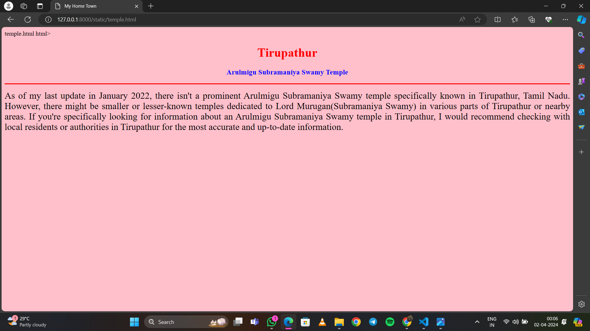

# Ex04 Places Around Me
## Date:26.03.24

## AIM
To develop a website to display details about the places around my house.

## DESIGN STEPS

### STEP 1
Create a Django admin interface.

### STEP 2
Download your city map from Google.

### STEP 3
Using ```<map>``` tag name the map.

### STEP 4
Create clickable regions in the image using ```<area>``` tag.

### STEP 5
Write HTML programs for all the regions identified.

### STEP 6
Execute the programs and publish them.

## CODE
```
map.html

<html>
<head>
<title>My City</title>
</head>
<body>
<h1 align="center">
<font color="red"><b>Tirupathur</b></font>
</h1>
<h3 align="center">
<font color="blue"><b>Dhanush P (23001835)</b></font>
</h3>
<center>

<map name="MyCity">
<area shape="rect" coords="700,250,850,400" href="home.html" title="My Home Town">
<area shape="circle" coords="570,230,45" href="temple.html" title="Arulmigu Subramaniya Swamy Temple">
<area shape="circle" coords="640,200,30" href="lake.html" title="Tiruparuthikundram Lake">
<area shape="circle" coords="1120,360,25" href="hill.html" title="Yelagiri Hills">
<area shape="rect" coords="950,120,1100,140" href="park.html" title="Sathuragiri Hill Forest Park">
</map>
</center>
</body>
</html>

home.html

html>
<head>
<title>My Home Town</title>
</head>
<body bgcolor="lime">
<h1 align="center">
<font color="cyan"><b>Tirupathur</b></font>
</h1>
<h3 align="center">
<font color="red"><b>Tirupathur - My Home Town<sub>2</sub>Way</b></font>
</h3>
<hr size="3" color="blue">
<p align="justify">
<font face="Tiruvannamalai" size="5">
Tirupathur, nestled in the southern part of India, holds a special place in my heart as my hometown. Situated in the Vellore district of Tamil Nadu, Tirupathur is a town rich in history, culture, and natural beauty.
At the heart of Tirupathur lies its vibrant marketplaces, where the bustle of daily life unfolds amidst the colorful array of shops and vendors. From aromatic spice stalls to bustling textile markets, 
the town's commerce thrives, reflecting its dynamic economy.
</font>
</p>
</body>
</html>

temple.html

temple.html

html>
<head>
<title>My Home Town</title>
</head>
<body bgcolor="pink">
<h1 align="center">
<font color="red"><b>Tirupathur</b></font>
</h1>
<h3 align="center">
<font color="blue"><b> Arulmigu Subramaniya Swamy Temple</b></font>
</h3>
<hr size="3" color="red">
<p align="justify">
<font face="Tirupathur" size="5">
As of my last update in January 2022, there isn't a prominent Arulmigu Subramaniya Swamy temple specifically known in Tirupathur, Tamil Nadu.
However, there might be smaller or lesser-known temples dedicated to Lord Murugan(Subramaniya Swamy) in various parts of Tirupathur or nearby areas.
If you're specifically looking for information about an Arulmigu Subramaniya Swamy temple in Tirupathur, I would recommend checking with local residents
or authorities in Tirupathur for the most accurate and up-to-date information.
</font>
</p>
</body>
</html>

lake.html

lake.html

html>
<head>
<title>My Home Town</title>
</head>
<body bgcolor="purple">
<h1 align="center">
<font color="cyan"><b>Tirupathur</b></font>
</h1>
<h3 align="center">
<font color="lime"><b>Tiruparuthikundram Lake</b></font>
</h3>
<hr size="3" color="red">
<p align="justify">
<font face="Tirupathur"size="5" color="white"></font>>
It appears you're asking about Tiruparuthikundram in relation to Tirupathur. While Tiruparuthikundram and Tirupathur are both located in Tamil Nadu, they are
distinct towns with their own unique features and attractions.Tiruparuthikundram is known for its hilltop temple dedicated to Lord Murugan, while Tirupathur 
is famous for its Sri Srinivasa Perumal Temple and its picturesque lake.
</font>
</p>
</body>
</html>

hill.html

hill.html

html>
<head>
<title>My Home Town</title>
</head>
<body bgcolor="purple">
<h1 align="center">
<font color="cyan"><b>Tirupathur</b></font>
</h1>
<h3 align="center">
<font color="lime"><b>Yelagiri Hill</b></font>
 </h3>
<hr size="3" color="red">
<p align="justify">
<font face="Tiruvannamalai" size="5" color="white"></font>>
Yelagiri Hills is a captivating hill station located near Tirupathur in the Vellore
district of Tamil Nadu, India. Situated approximately 150 kilometers away from Tirupathur, 
Yelagiri offers a serene retreat amidst nature's splendor for locals and tourists alike.
</font>
</p>
</body>
</html>

park.html

dam.html

html>
<head>
<title>My Home Town</title>
</head>
<body bgcolor="purple">
<h1 align="center">
<font color="cyan"><b>Tirupathur</b></font>
</h1>
<h3 align="center">
<font color="lime"><b>Pasathuragiri Hill Forest park</b></font>
</h3>
<hr size="3" color="red">
<p align="justify">
<font face="Tirupathur" size="5" color="white"></font>>
As of my last update in January 2022, there isn't a prominent park known as "Pasathuragiri Hill Forest Park" specifically in Tirupathur, Tamil Nadu. 
However, there might be lesser-known or newly developed parks or recreational areas in or around Tirupathur that I may not be aware of.
If you're specifically looking for information about Pasathuragiri Hill Forest Park or any other park in Tirupathur, I would recommend 
checking with local residents, tourism authorities, or online resources for the most accurate and up-to-date information.
</font>
</p>
</body>
</html>
```
## OUTPUT


  
  
  
  
 


## RESULT
The program for implementing image maps using HTML is executed successfully.
